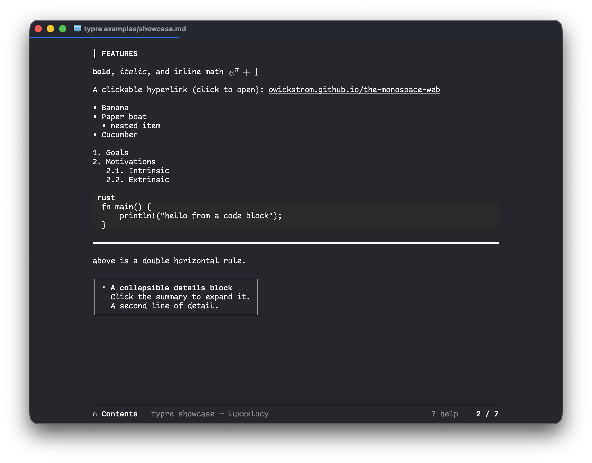

# typre

`typre` is a terminal slideshow tool with two main goals:
1. Better visualize and read existing markdown documents as slides in terminal we do not need to switch to other applications.
2. Authoring markdown based slides with extended commands in the `◊` format (similar to that of [pollen](https://docs.racket-lang.org/pollen/)), for example, Typst diagram to it by `◊typst{...}`.

> Note: `shift-option-v` in MacOS inputs ths `◊` symbol.



## Requirements

- A terminal that speaks the kitty graphics protocol: Ghostty, kitty, or WezTerm.
- If needs typst, the `typst` cli needs to be installed

## Quick start

```
cargo build --release        # binary at target/release/typre
cargo run -- examples/showcase.md

cargo install --path .       # or simply install it
typre examples/showcase.md
```

When authoring, we just need to write in plain markdown.
- A top-level `#` heading will be shown as a centered title slide;
- each `##` starts a new slide; `###` and deeper `h` subsections will not create new slides.
- Extension Typst command is by `◊typst{...}` carries typst. Math following typst's own syntax.
- Additional command such as `◊width` is supported. `◊width[SPEC]{...}` renders the same body as a sized block, where SPEC can be
    - `70%` (percent of the content column),
    - `60` (absolute columns),
    - or `full`.

```markdown
Inline math ◊typst{e^(i pi) + 1 = 0} in a sentence.

◊typst{sum_(i=1)^n i = (n (n+1)) / 2}

◊width[70%]{
#import "diagram.typ": diagram
#diagram
}
```

## Features

- basic viewing and authoring.
- headings, bold, italic, inline code, code blocks, lists,.
- some heuristic math, image auto-sizing.
- Typst support
- detail block
- scroll bars
- TOC auto-generated in the title page (and clickable)

## More examples

- `examples/showcase.md` — text, block math, a cetz drawing, an imported figure, inline math, and the monospace-web constructs (links, rule, lists, table, tree, grid, figure, details).
- `examples/diagram.typ` — a self-contained cetz schematic, imported by the showcase.

## Development&Testing

For scripting and tests, without an interactive terminal:

- `typre --dump-ops <deck>` prints the parsed slides and the render operations.
- `typre --export <deck> [-o FILE]` runs the full pipeline, including typst rasterization, and writes the terminal byte stream.
